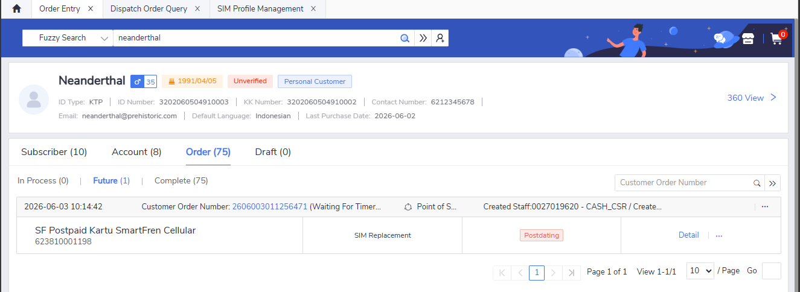
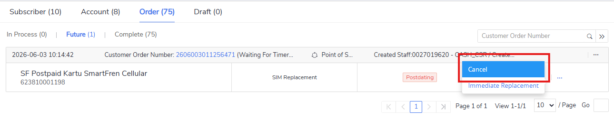
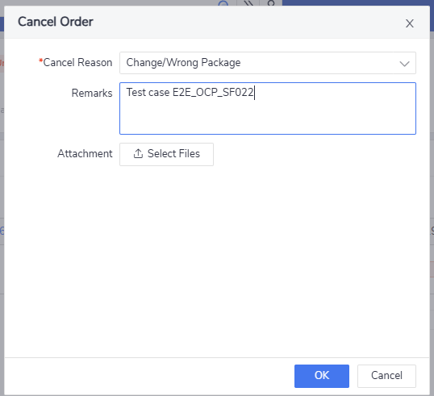
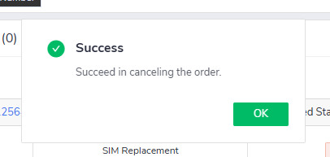
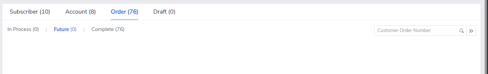

# Test Ticket E2E_OCP_SF022

**Description**: Cancel SIM replacement postdating order success

**Pre-requisite**:

1. The system is running normally.
2. Existing SIM replacement postdating order.

**Test Status:** ***SUCCESS✅***

**Steps**:

| No. | Step                                             | Data | Expected Result                                                |
| --- | ------------------------------------------------ | ---- | -------------------------------------------------------------- |
| 1   | Go to **'Order Entry' GUI**.                     | -    | Open **'Order Entry' GUI** successfully.                       |
| 2   | Query MDN with SIM replacement postdating order. | -    | Select MDN with SIM replacement postdating order successfully. |
| 3   | Cancel SIM replacement postdating order.         | -    | Cancel SIM replacement postdating order successfully.          |

**Evidence Results:**

Postdating order can be queried successfully:

!!! tip "Tip"
    We can make an order to be in postading state manually. Upon issuing order, make sure to check the order reason either one of these: ***Document need validation***, ***request from different customer***, and ***others***.

Cancel order option is available and can be clicked:

Cancel order from is correctly shown and form is able to fill:

Upon clicking, success message is shown:

After closing the success message, future order is now empty, cancel postdating order is successfully done:

