# Test Ticket SF_E2E_OCP_001

**Description**: Test new connection using prepaid main offer:SF Prepaid Kartu Smartfren Cellullar and additional offer : Kuota 6 GB.

Attempt to Upload attachment file name over 150 characters/less than 150 characters.

**Pre-requisite**:

1. System is running normally.

2. Config is effective.

3. The prepaid account e-bill email is empty ,the customer contact email has value.

**Test Status:** ***SUCCESS✅***

**Steps**:

| No. | Step | Data | Expected Result |
| :--- | :--- | :--- | :--- |
| 1 | Retrieve customer | | Retrieve customer successfully |
| 2 | Select offer |  Main offer:SF Prepaid Kartu Smartfren Cellullar; Additional offer : Kuota 6 GB| Select offer successfully |
| 3 | Select preferred language | | Select preferred language successfully |
| 4 | Select account | | Select account successfully |
| 5 | Select preferred contact channel | | Select preferred contact channel successfully |
| 6 | Input social media info | | Input social media info successfully |
| 7 | Select/Input Other Attribute | | Select/Input Other Attribute successfully |
| 8 | Select number | | Select MSISDN successfully |
| 9 | Select additional offer | | Select additional offer successfully |
| 10 | Select contact information | | Select contact information successfully |
| 11 | Upload attachment file name over/less than 5.00MB | | If upload attachment file name over 5.00MB, uploading file will fail. Otherwise, it will be success. |
| 12 | Input/scan ICCID | | Input/scan ICCID successfully |
| 13 | Order Review | | Order Review successfully |
| 14 | Payment | | Payment successfully |
| 15 | Order Submission | | Order Submission successfully |
| 16 | Review e-Receipt and e-RF | | Review e-Receipt and e-RF successfully |
| 17 | Check order state and check additional offer effect date and expire date | | Order completed successfully, the additional offer effect date and expire date display correctly. |
| 18 | Check order detail attachment | | The order detail attachment name displays normally. |
| 19 | Check order detail to resend e-Request Form, click send email | | Default email address is customer contact email, and it can choose same customer other account E-Bill email. |

**Evidence Results:**

Customer retrieved successfully:

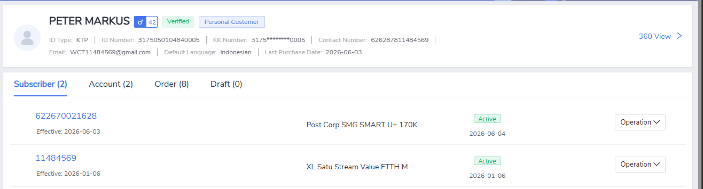

Main offer (SF Prepaid Kartu Smartfren Cellular) and additional offer (Kuota 6 GB) selected:

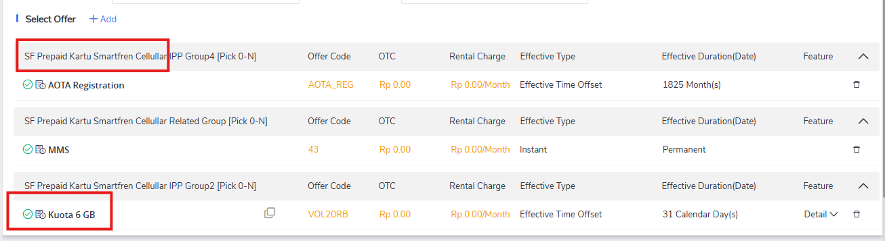

Preferred language selected:

Account is automatically generated by the system (for prepaid only), all basic informations are succesfully filled, as well as MSISDN:

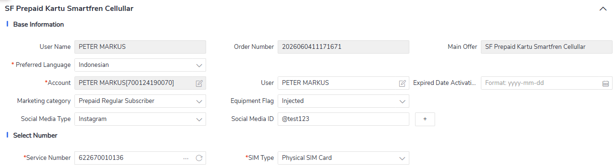

Contact information selected:

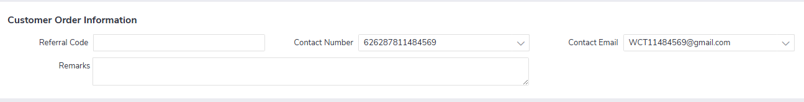

Attachment upload tested - file over 5.00MB rejected, file under 5.00MB accepted:

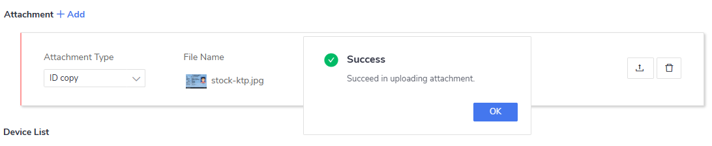

!!! note "Note"
    For file above 5MB, the system currently only stall and no error or warning shown, only hint that "The file size limit is 5.00MB."

ICCID input/scanned successfully:

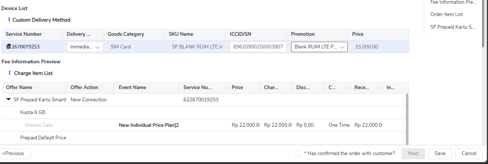

Order review completed:

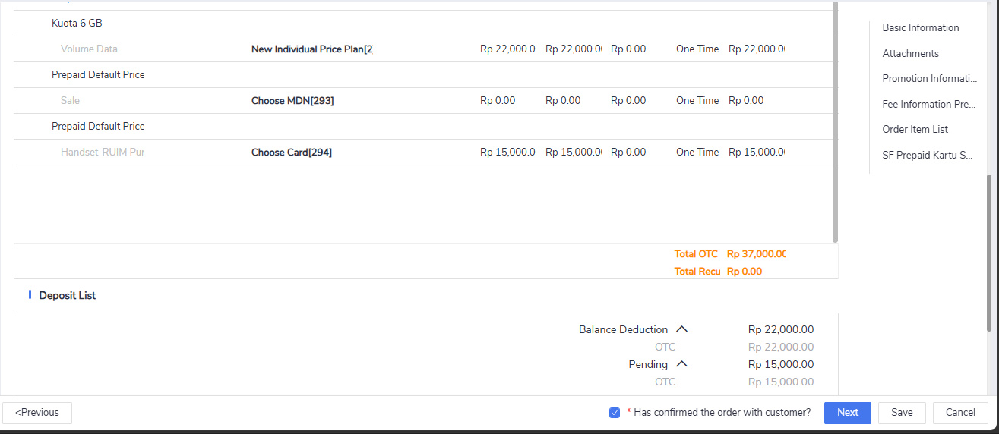

Order submitted successfully:

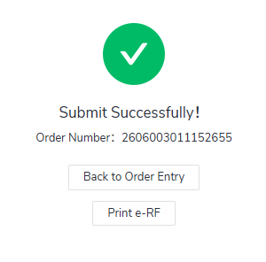

!!! note "Note"
    Payment is waivered.

e-Receipt and e-RF reviewed:

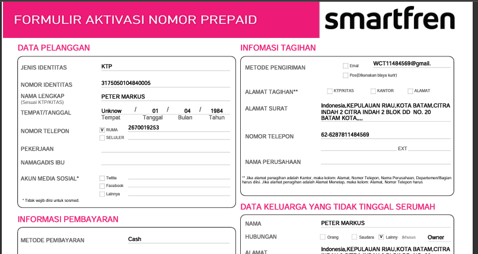

Order completed, subscriber additional offer effect date and expire date displayed correctly:

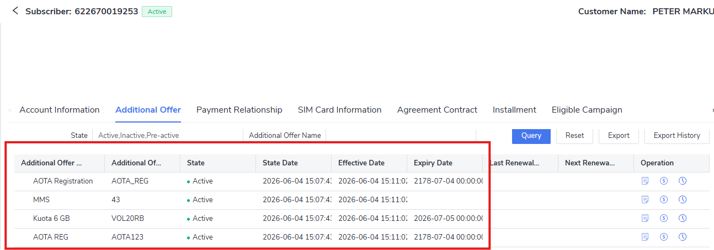

Order detail attachment name displayed normally:

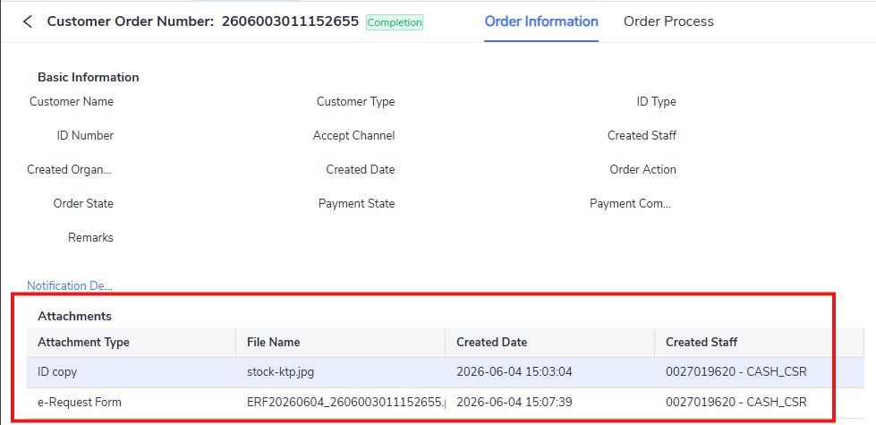

Resend e-Request Form - default email is customer contact email, other account E-Bill email selectable:

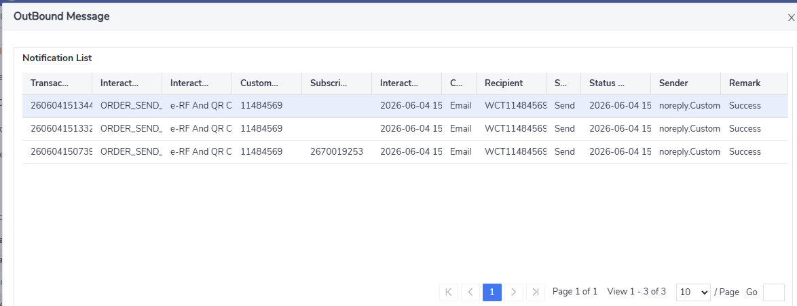
