# Test Ticket SF_E2E_OCP_016

**Description**: This is a test for user new connection to active by first call

**Pre-requisite**:

1. System is running normally
2. Config is effective
3. **Existing inactive prepaid subscriber**
4. The new connection inactive subscriber has **additional offer** with **effective date** and **expire date**.

**Test Status:** **_SUCCESS✅_**

**Steps**:

| No. | Step                                                                                                    | Data | Expected Results                                                                                                          |
| --- | ------------------------------------------------------------------------------------------------------- | ---- | ------------------------------------------------------------------------------------------------------------------------- |
| 1   | Go to 'Order Entry' GUI                                                                                 |      | Open order entry success                                                                                                  |
| 2   | Query an individual customer                                                                            |      | Can retrieve individual customer success                                                                                  |
| 3   | Select inactive prepaid subscriber                                                                      |      | Can select inactive prepaid subscriber                                                                                    |
| 4   | Open operation and click 'First Call Activation' button                                                 |      | Can select first call activation                                                                                          |
| 5   | Review order detail and click 'Next' button                                                             |      | Go to next page success                                                                                                   |
| 6   | Upload attachment file and select 'Has confirmed the order with customer?' and then click 'Next' button |      | Upload attachment file success                                                                                            |
| 7   | Select 'Bypass Acknowledge' and click 'Next' button                                                     |      | Bypass acknowledge success                                                                                                |
| 8   | Pay the order                                                                                           |      | Pay order success                                                                                                         |
| 9   | Check e-RF                                                                                              |      | The receipt form detail are success                                                                                       |
| 10  | Submit order                                                                                            |      | Submit order success                                                                                                      |
| 11  | Check the order                                                                                         |      | The order is completion                                                                                                   |
| 12  | Check subscriber state and IPP and balance                                                              |      | The subscriber is active, IPP is effective and it is given benefits                                                       |
| 13  | Check the notification                                                                                  |      | Customer can receive notification                                                                                         |
| 14  | Check the additional offer effective date and expire date                                               |      | The additional offer effective date and expire date have updated according to First Call Activation order completion time |

**Evidence Results:**

Selected additional offer with effective date and expired date for pre-requisite:

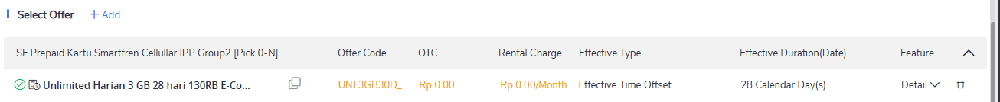

Inactive prepaid subscription is available:

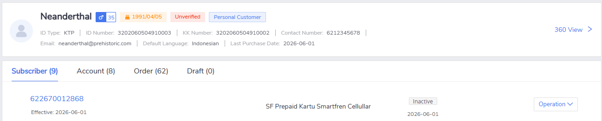

Can select 'First Call Activation' menu from operations:

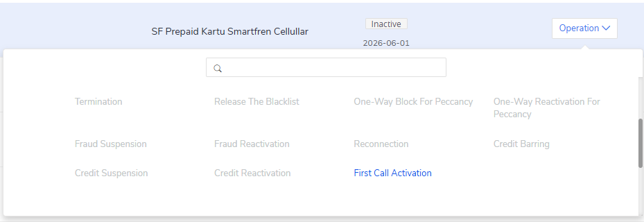

Review order success, details of order can be clearly seen:

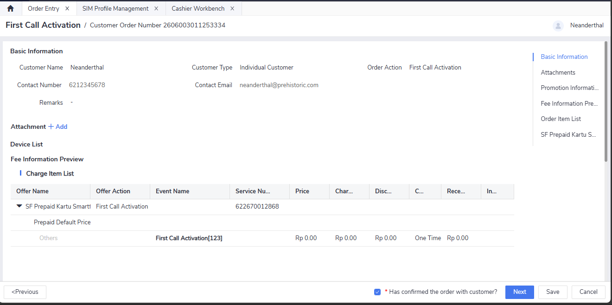

Bypassing acknowledge works fine:

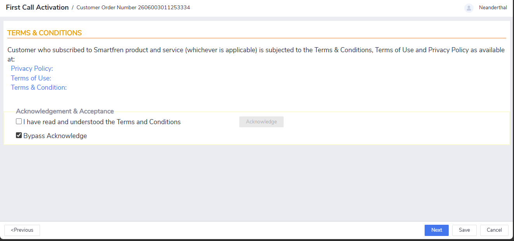

Pay order is success:

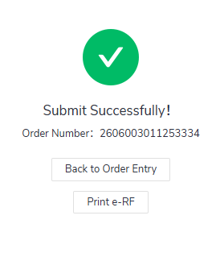

ERF is shown correctly as 'First Call Activation' transaction data. Service number is also shown correctly as `62 02670012868`:

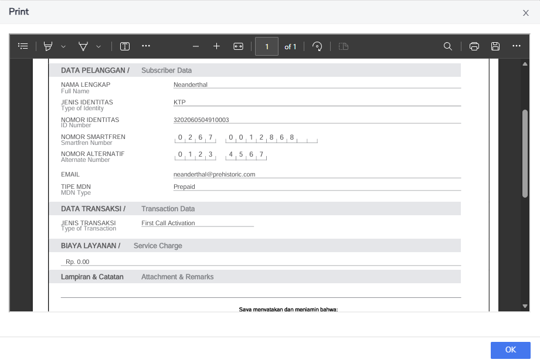

Subscriber is now active, IPP is also active (highlighted by the red box). We can also see that the state date (initial inactive) and the effective date (after FCA) is different:

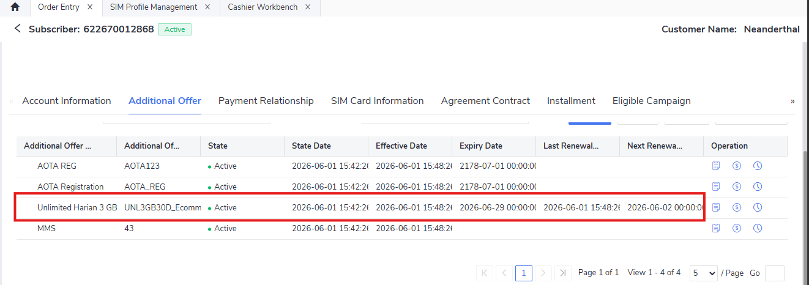

For the notification, currently the user is not in the whitelist due to simulation. So, it cannot be send successfully. However, the notification can be initiated from this menu:

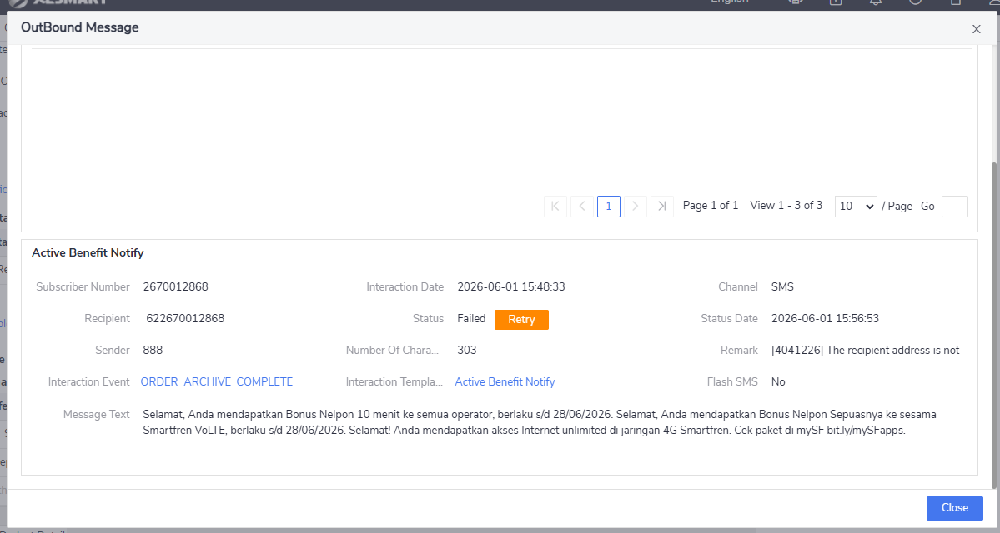

!!! note "Reminder"
    Don't forget to add the customer contact to the CIC whitelist to enable them receive notification smoothly. Can be done from *Menu > CIC Address Whitelist Management > Add email/service number (phonenum)*

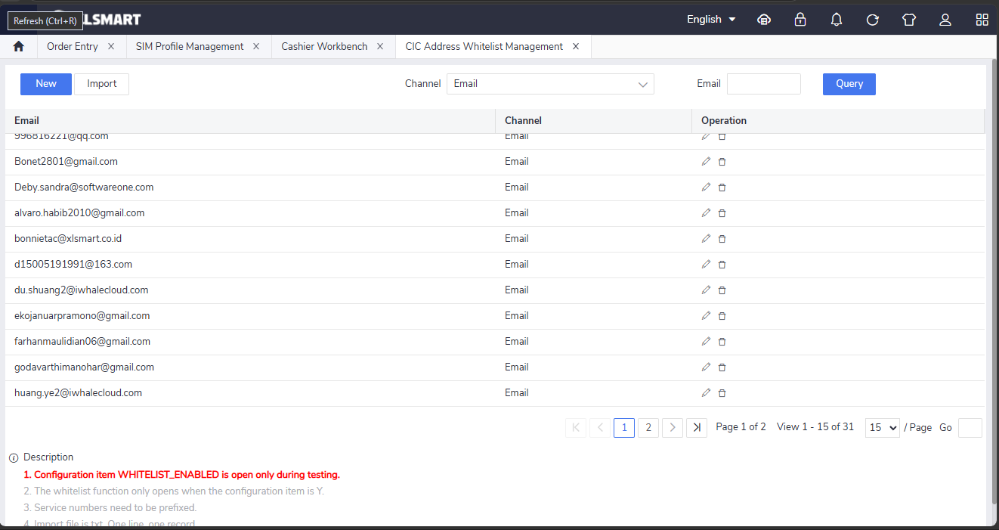

After adding, we can see that the notification is sent successfully:

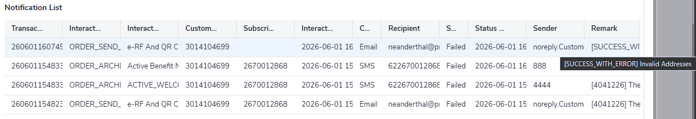

_Note: although the state is failed, the actual message is SUCCESS_WITH_ERROR because the email is just an example email, not real._
