# Test Ticket SF_E2E_OCP_018

**Description**: SIM replacement order is used when customer request a new sim card. This order is applicable for both prepaid and postpaid subscriber.

**Pre-requisite**:

1. System is running normally
2. Subscriber status is active
3. The SIM replacement order has OTC fee

**Test Status:** ***SUCCESS✅***

| No. | Step | Data | Expected Result |
| :--- | :--- | :--- | :--- |
| 1 | 1. Click on the order center >> Order Entry menu | MDN: 622740000589<br>ICCID: 89620900250003807310 (physical SIM card) | 1. The menu responds normally and the foreground page opens correctly. |
| 2 | 2. Retrieve customer by name/ID number, locate subscriber via MSISDN, click 'Change' then 'SIM Replacement' | Customer name/ID number, MSISDN | 2. Retrieve customer by customer name/ID number is OK |
| 3 | 3. Create SIM replacement order (pre-validation) | Pending order, Overdue amount (Postpaid only), Subscriber status (Active/Barring/Suspension), Retailer MDN | 3.1 Pending order check passes.<br>3.2 Overdue amount validation passes.<br>3.3 Subscriber status validation passes (exception for suspension due to lost/Voluntary Suspension).<br>3.4 For retailer MDN: warning & approval required after order submit. |
| 4 | 4. Input/scan new ICCID, choose promotion | New ICCID (manual/scan), eSIM selection, Promotion choice | 4.1 ICCID belongs to user's organization.<br>4.2 ICCID status is "available".<br>4.3 MSISDN/ICCID belongs to same HLR.<br>Tip: ICCID becomes 'Locked' (auto-released after X mins).<br>Different promotions display correct OTC fee. |
| 5 | 5. Select SIM replacement reason | LOVs: Lost and stolen, Sim faulty, Manufacturer Defect, Sim Upgrade | 5. The four enumeration values display correctly, can be chosen successfully. |
| 6 | 6. Select contact information & verify | Contact info, SIM replacement reason (with X times limit for "Manufacturer Defect"), Attachment (for retailer/corporate) | 6.1 Information check is completed.<br>6.2 Reason checking passes (within X times limit).<br>6.3 Attachment uploaded (for retailer/corporate), else prompt. |
| 7 | 7. Order review | Order summary, Attachments, Modify/Save/Back/Next/Cancel buttons | 7. Order details can be reviewed.<br>Attachments can be uploaded (multiple).<br>Buttons function correctly (Modify, Back, Save draft, Next to T&C, Cancel). |
| 8 | 8. T&C | T&C document, E-signature | 8. Customer must accept T&C and acknowledge via E-signature. |
| 9 | 9. Payment | Fee info, Waiver button, Benefit/Deposit lists, Top-up amount, Payment summary, Payment methods (Cash/Balance) | 9. Order is created (cannot go back).<br>Fee waiver, payment summary review, top-up selection supported.<br>'Pay' button redirects to payment collection.<br>After payment, page auto-closes and redirects. |
| 10 | 10. Review e-Receipt and e-RF | e-Receipt, e-Request form (e-RF), POS receipt, eSIM QR code | 10. User can print e-RF (not dealer), print e-Receipt (A4), print POS receipt, view eSIM QR code. |
| 11 | 11. Order submission | Submission button | 11. Order successfully submitted and is in order approval stage. |
| 12 | 12. Order provisioning | Order sent to network | 12. Order provisioning is OK. |
| 13 | 13. Order completion | SMS notification, ICCID update, SIM Card Restore order (if suspended due to lost) | 13.1 SMS notification sent to customer.<br>13.2 Subscriber ICCID updated.<br>13.3 Auto-create SIM Card Restore order if suspended due to lost. |
| 14 | 14. After SIM replacement | Balance and price plan | 14. Balance and price plan are carried forward (no change). |
| 15 | 15. Staff pays order by Cash or Balance | Payment method: Cash or Balance | 15. **If Cash:** Deduct detail displays service number only.<br>**If Balance:** Deduct detail displays service number AND account information. |
**Evidence Results:**

!!! note "Note"
    This test will explore the **postpaid way** to explore the additional option which will only be available in the postpaid service.

**Initial state verification** - Subscriber status is active, system running normally:

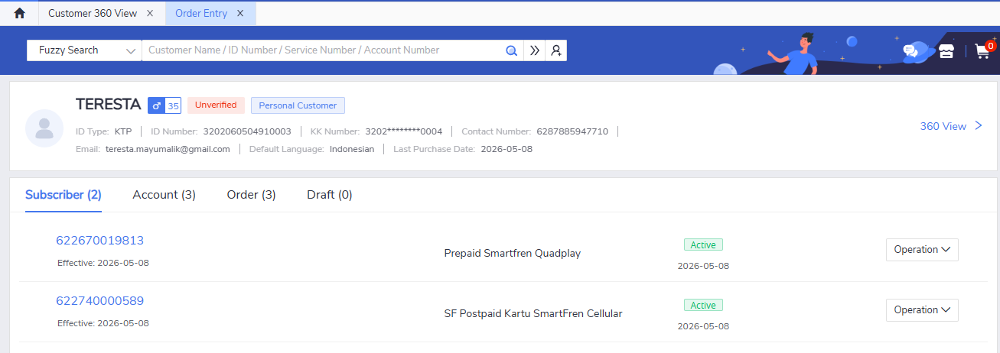

Moreover, the ICCID and service number is correctly recorded in database, under `sic.ic_acc_nbr` and `sic.ic_sim_card` table:

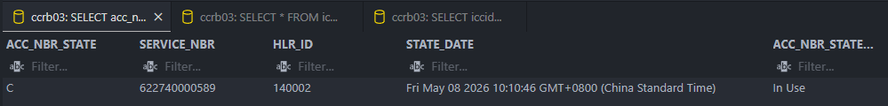
*Service number inidicating state 'C' -> in-use*

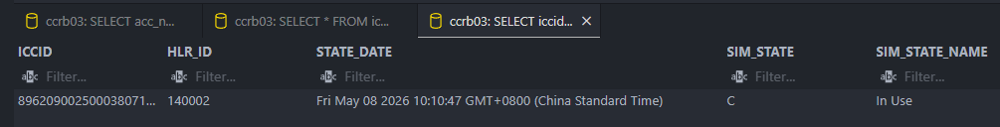
*SIM card state indicating 'C' -> in-use*

The data is queried using this syntax:

```sql
SELECT 
  prefix || acc_nbr AS service_nbr, hlr_id,
  state_date, acc_nbr_state, acc_nbr_state_name
FROM ic_acc_nbr
INNER JOIN ic_acc_nbr_state USING (acc_nbr_state)
WHERE prefix || acc_nbr = '622740000589';

SELECT 
  iccid, hlr_id, state_date,
  sim_state, sim_state_name
FROM ic_sim_card
INNER JOIN ic_sim_state USING (sim_state)
WHERE iccid='89620900250003807160';
```

SIM Replacement option is available can be selected:

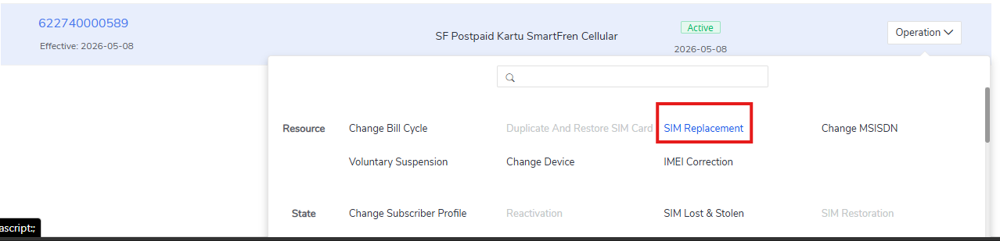

Pre-validation checks passed (pending order, overdue amount, subscriber status, retailer MDN) and can be continued to the order entry page:

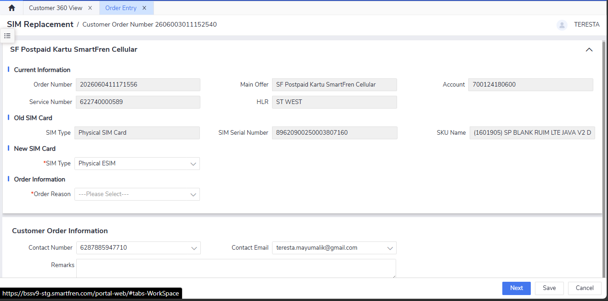

Upon selecting the SIM card type, when user selected eSIM, system can auto generate the ICCID successfully:

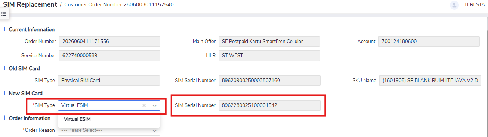

But in this testing case, physical SIM card will be chosen.

SIM replacement reason selected from LOVs (Lost/Stolen, Sim Faulty, Manufacturer Defect, Sim Upgrade):

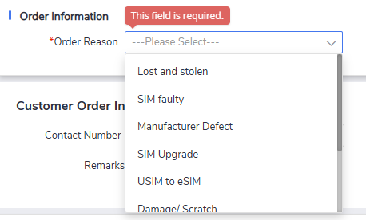

The new ICCID is confirmed to be in 'Available' state and has not been bounded to other subscriber:

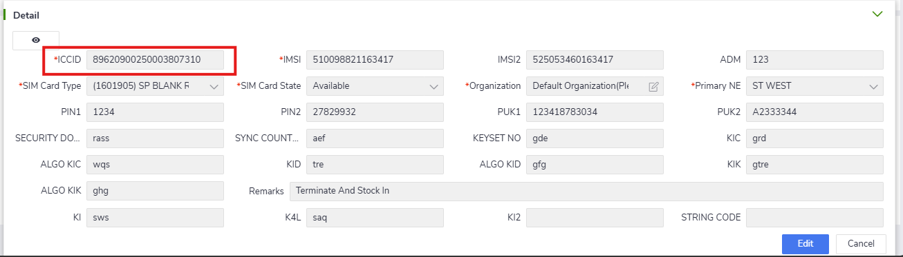

ICCID input is working correclty and can write the new ICCID:

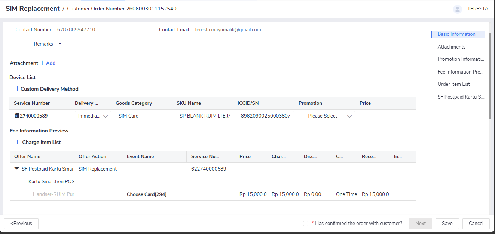

If the selected ICCID is already in state 'C' -> 'In-Use', then error is shown correctly:

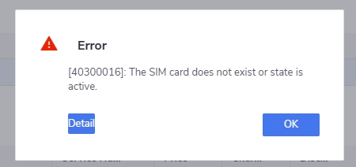

!!! tip "Tip"
    Behind the scene, SIM card will go through state change from the initial 'I' -> 'Available' to become 'L' -> 'Locked' after inputting the ICCID.

The state change can also queried in the database inside `sic.ic_sim_card` table:


Contact information verified, attachment uploaded successfully:

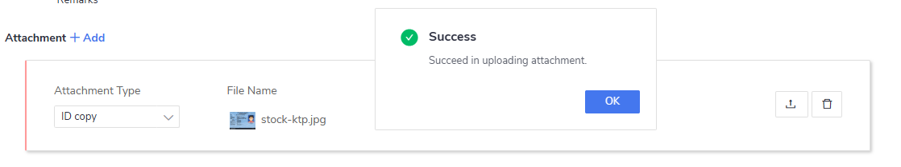

Order review completed, all buttons (Modify/Save/Back/Next/Cancel) functioning correctly and the OTC is calculated accurately:

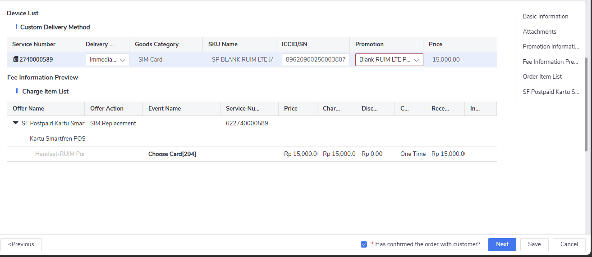

T&C accepted and e-signature completed (bypassed in this test):

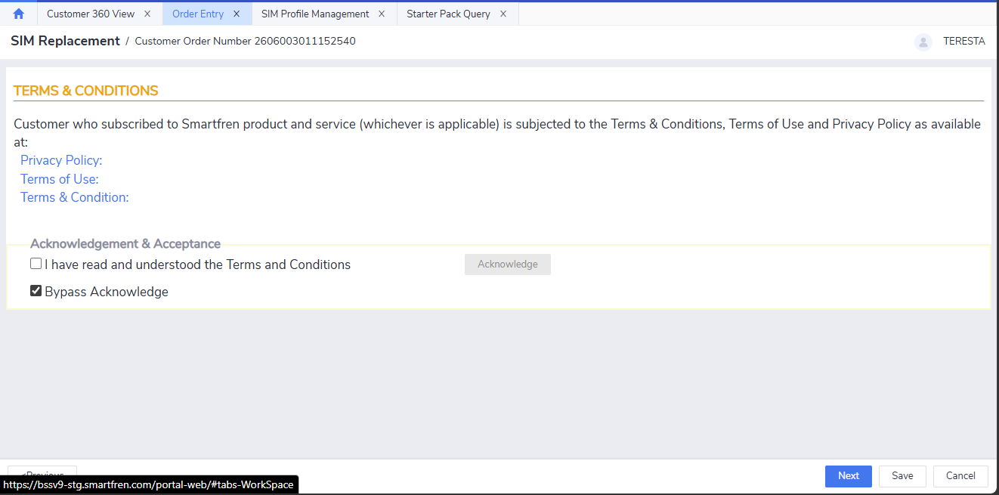

Payment processed successfully (fee waiver/top-up options available) for this case will select 'Cash':

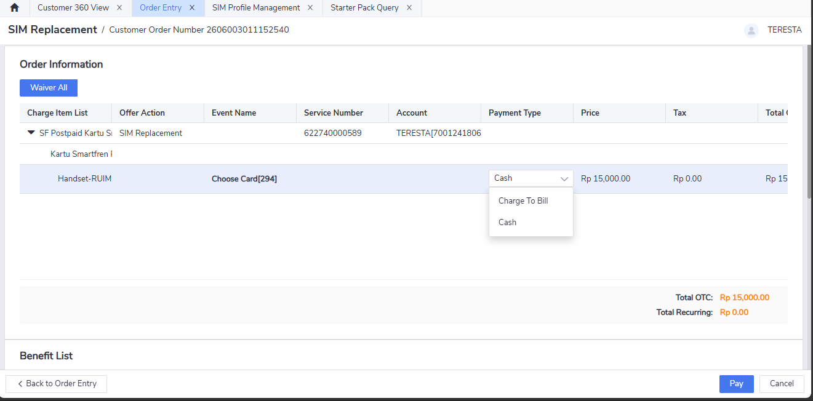

Payment can be proceeded and completed:


e-Receipt and e-RF printed successfully. The eRF information is also showing the correct transaction detail and showing old and new ICCID update:

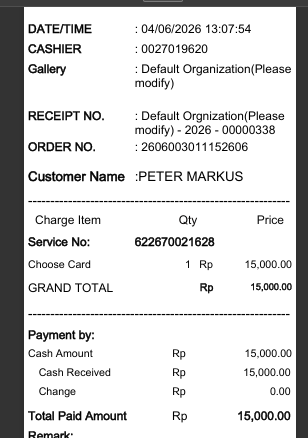
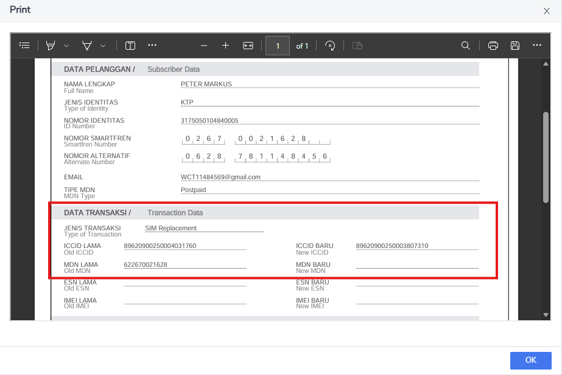

Further check in `sic.ic_sim_card` table also showing state update from 'I' -> 'Available' to 'C' -> 'In Use':

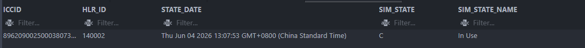

Order submitted successfully, now in approval stage:

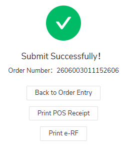

Order provisioning to network completed and provisioning state is 'B' -> 'Completion':

!!! tip "Tip"
    The provisioning record and information can be queried inside `spn.sa_order` and with the query provided below:

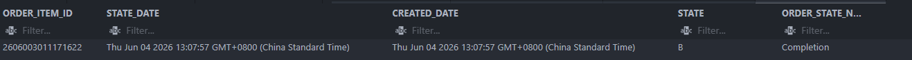

```sql
SELECT 
order_item_id, state_date, created_date,
state, order_state_name
FROM spn.sa_order
INNER JOIN spn.sa_order_state ON spn.sa_order.state = spn.sa_order_state.order_state
WHERE order_item_id=2606003011171622;
```

Order completion verified, ICCID updated in subscriber details:

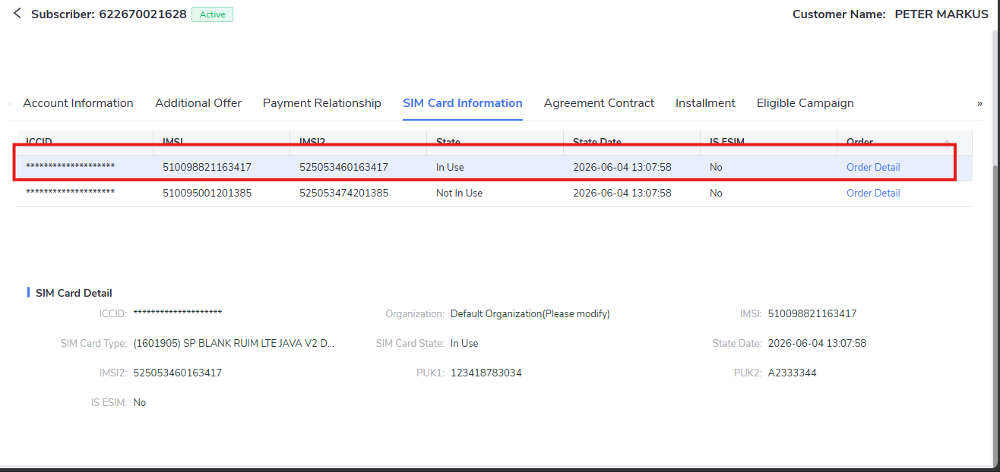

Payment deduction details verified (Cash: service number only / Balance: service number + account info). In this test case, payment method selected is "Cash" so only service number is shown and no account number:

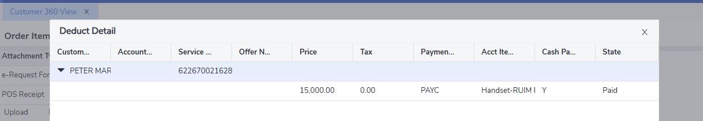
