# Test Ticket SF_E2E_OCP_058

**Description**: Active subscriber orders IPP by Modify Offer

**Pre-requisite**:

1. System is running normally
2. Config is effective
3. **Subscriber status is active**
4. (Prepaid) Balance is no less than the new IPP price

**Test Status:** ***SUCCESS✅***

**Steps**:

| No. | Step | Data | Expected Results |
|-----|------|------|------------------|
| 1 | Open the Order Entry menu | 622670012868 | Enter Order Entry menu successfully |
| 2 | Search subscriber, click Modify Offer and order an IPP |  | Jump to next page successfully |
| 3 | Click "Pay" and check the result |  | Payment success. All charges for this order are correct. e-RF and POS receipt show correctly. |
| 4 | Check notification |  | Modify Offer finishes and sends SMS successfully |
| 5 | Go to Order Entry and check order history |  | The order state is completion and order details are correct |
| 6 | Enter Account Receivable to check result |  | Account Receivable menu displays Account Balance and Charging Detail correctly |
| 7 | Check Customer 360 View for subscriber detail information |  | Subscriber detail information interface is correct in Customer 360 View |

**Evidence Results:**

Order entry is showing correct customer with MSISDN `622670012868`:

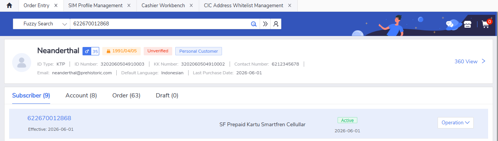

Modify offer operation is allowed and can be clicked:

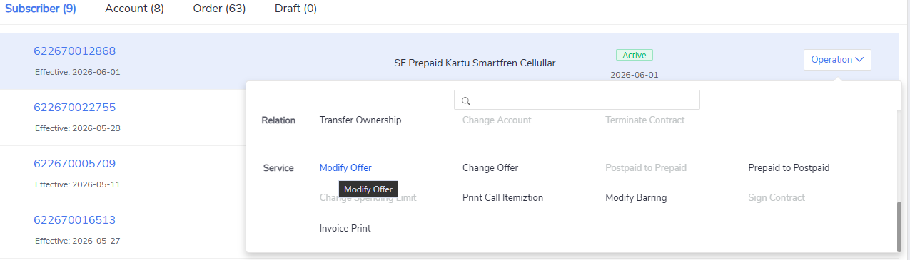

Selecting an IPP works just fine and can be continued to the next step:

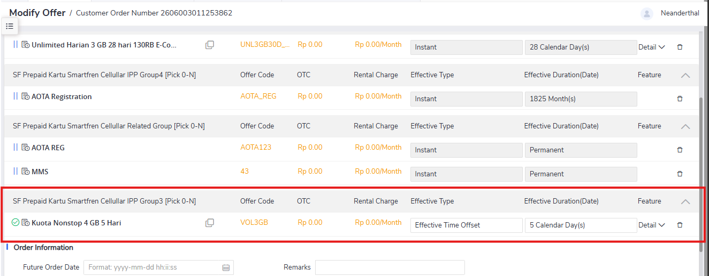

After continuing to the order preview page, we can see that the OTC is calculated directly:

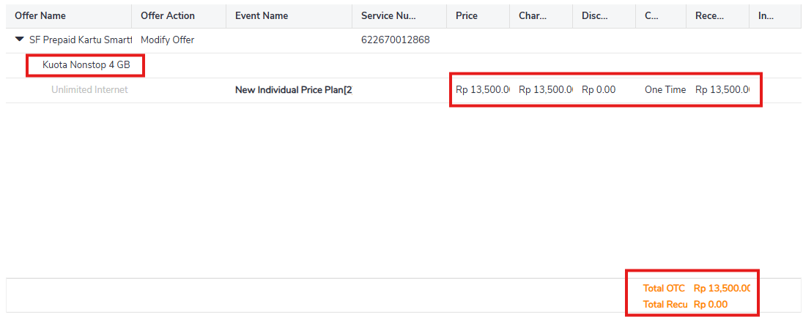

!!! warning "Attention"
    Make sure the subcriber has enough balance. Otherwise, there will be an error shown below:

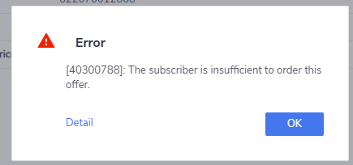

After the order is reviewed and confirmed, we can proceed to the payment. In prepaid services, **only balance payment method is supported!**. The OTC is correctly shown:

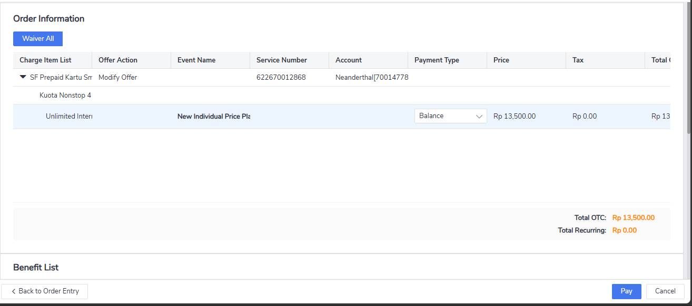

Once payment is done, receipt is showing correct information with the selected IPP name and price, as well as the date/time:

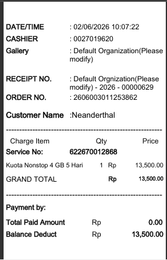

Verification in order detail page also showing correct information:

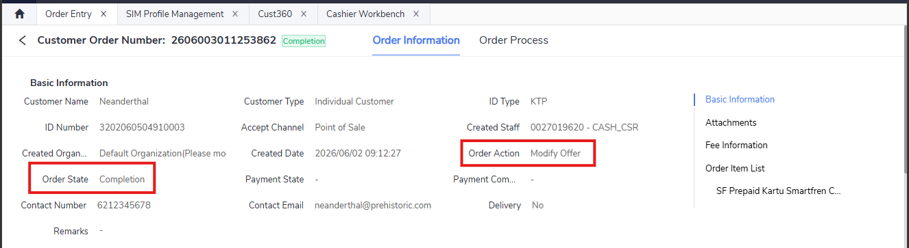

Under the benefit list, the new IPP is also correctly displayed:

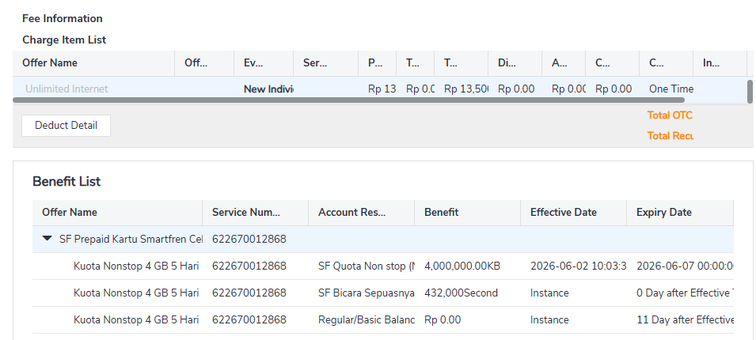

In account receivable, the balance is also shown correctly:

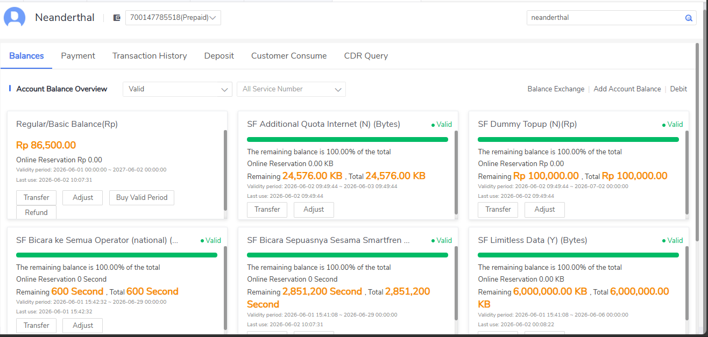

In Cust360 subsciber detail page, the new additional offer is also correctly shown and active:

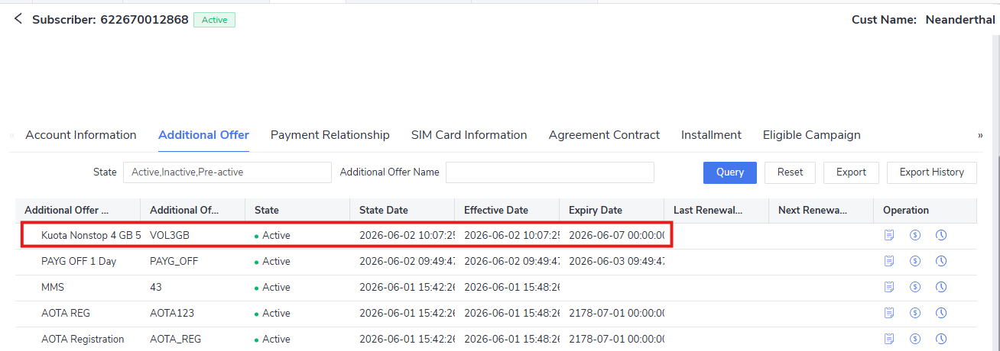