# Test Ticket SF_E2E_OCP_085

**Description**: Change main offer with add additional offer + effective immediately

**Pre-requisite**:

1. The system is running normally.
2. Existing active postpaid subscription.
3. The subscriber dont have pending order.
4. The customer is not in dunning blacklist.
5. The customer is not in internal blacklist.
6. Under the customer, all account have no overdue amount.

**Test Status:** ***SUCCESS✅***

**Steps**:

| No. | Step | Data | Expected Result |
| :--- | :--- | :--- | :--- |
| 1 | Go to 'Order Entry' GUI. | | Go to 'Order Entry' GUI successfully. |
| 2 | Query an active postpaid subscription. | | Query an active postpaid subscription successfully. |
| 3 | Click [Operation-> Change Offer] in 'Subscriber' Tab. | | It jumps to next page successfully. |
| 4 | Choose new main offer and add on additional offer, the effective time is immediate, and then click 'Next' button. | | Select new main offer successfully. |
| 5 | Review basic information/order fee/order item list and so on. | | The basic information/order fee/order item list and others are correct. |
| 6 | Select 'Has confirmed the order with customer?' and click 'Next' button. | | It jumps to next page successfully. |
| 7 | Review and check the T&C. | | Review and check the T&C successfully. |
| 8 | In payment counter, review order fee and pay it. | | Pay order fee finished (ETP). |
| 9 | Review and print 'Print POS Receipt'/'Print e-Receipt'/'Print e-RF'. | | Review and print successfully and the information is correct. |
| 10 | Click 'Next' button and submit the order. | | Generated order successfully. |
| 11 | Back to order entry page, and check the order detail. | | The order is complete and order information is correct. |
| 12 | Go to [Subscriber Detail] and check subscriber information. | | The subscription's status is 'Active' and additional offer is active too. |
| 13 | Check the notification. | | System will send notification to customer successfully. |

**Evidence Results:**

Active postpaid subscription queried successfully in Order Entry:

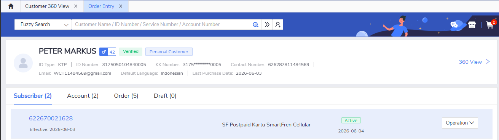

Change Offer option selected, jumps to offer selection page:

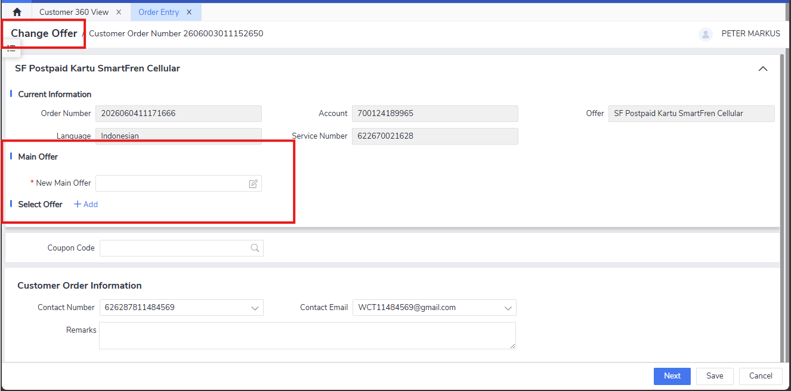

New main offer and additional offer selected, effective time set to immediate:

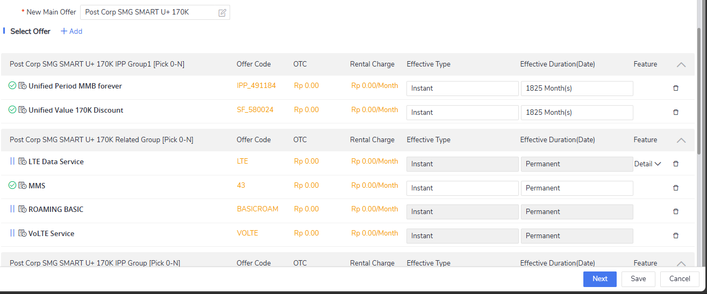

Additionally, the previous main offer IPP will also be cancelled and the cancellation display is displayed correctly:

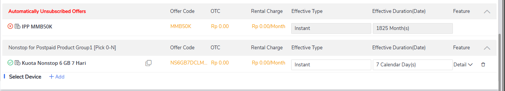

Order details reviewed (basic info, order fee, order item list) - all correct:

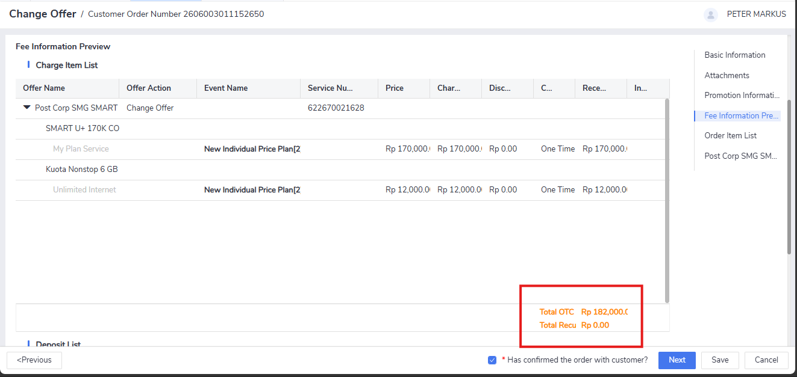

T&C reviewed and accepted successfully:

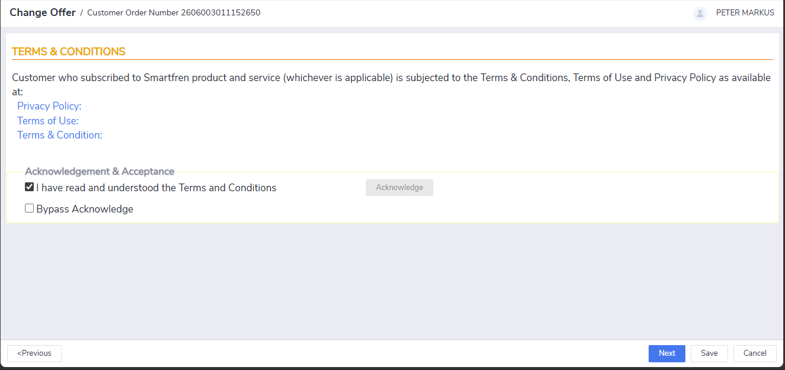

Payment counter displayed, order fee paid successfully (ETP):

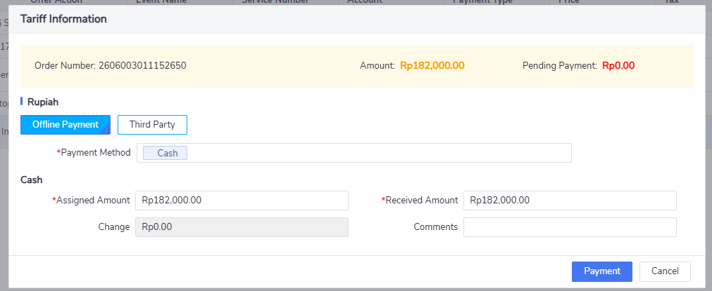

POS Receipt, e-Receipt, and e-RF printed successfully with correct information:

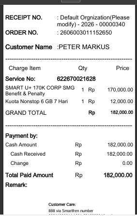
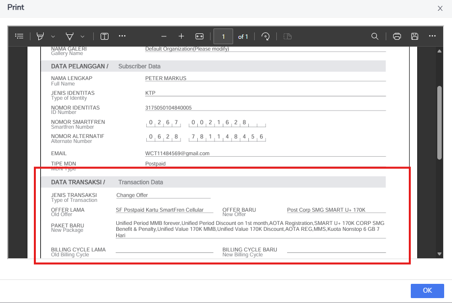

Order submitted successfully, order status shows complete:

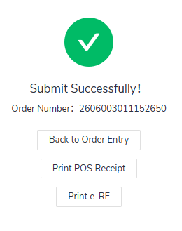
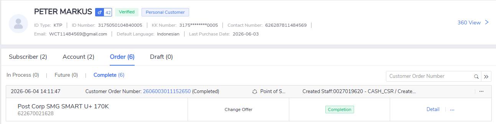

Subscriber Detail verified - **subscription status is Active, additional offer is active**:

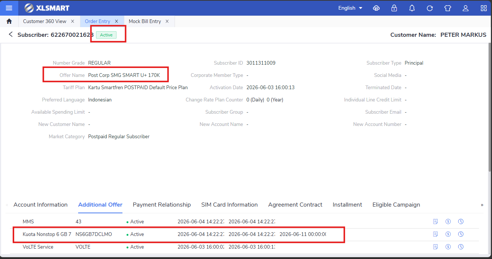

Notification sent to customer successfully:

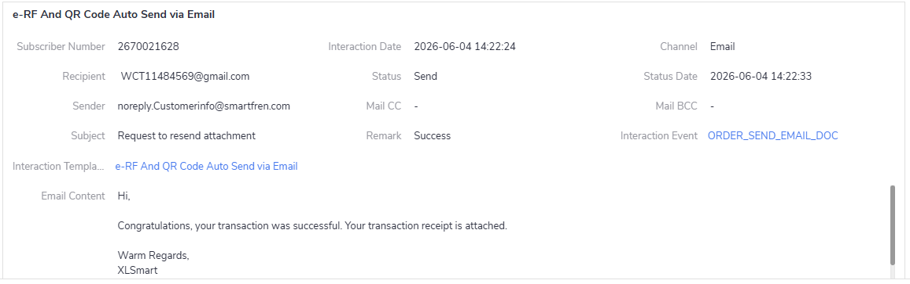