# Test Ticket SF_E2E_OCP_126

**Description**: Transfer ownership for the unique postpaid subscriber under the account

**Pre-requisite**:

1. The system is running normally.
2. Existing an active postpaid subscription.
3. The subscriber dont have pending order.
4. The source/target customer is not in dunning blacklist.
5. The source/target customer is not in internal blacklist.
6. Under the customer, all account have no overdue amount.
7. The subscriber dont have outstanding amount.

**Test Status:** ***SUCCESS✅***

**Steps**:

| No. | Step | Data | Expected Result |
| :--- | :--- | :--- | :--- |
| 1 | Go to 'Order Entry' GUI. | | Go to 'Order Entry' GUI successfully. |
| 2 | Query an active postpaid subscription. | | Query an active subscription successfully. |
| 3 | Click [Operation-> Transfer Ownership] in 'Subscriber' Tab. | | It jumps to next page successfully. |
| 4 | Select target customer and create new account, and then click 'Next' button. | | Select target customer and create new account successfully. |
| 5 | Review basic information/order fee/order item list and so on. | | The basic information/order fee/order item list and others are correct. The Customer Order Information displays old customer Contact Number and Contact Email. |
| 6 | Select 'Has confirmed the order with customer?' and click 'Next' button. | | It jumps to next page successfully. |
| 7 | Review and check the T&C. | | Review and check the T&C successfully. |
| 8 | In payment counter, review order fee and pay it. | | Pay order fee finished. |
| 9 | Review and print 'Print POS Receipt'/'Print e-Receipt'/'Print e-RF'. | | Review and print 'Print POS Receipt'/'Print e-Receipt'/'Print e-RF' successfully and the e-RF file can display the new billing address. |
| 10 | Click 'Next' button and submit the order. | | Generated order successfully. |
| 11 | Back to order entry page, and check the order detail. | | The order is complete and order information is correct. |
| 12 | Go to [Subscriber Detail] and check subscriber information. | | The subscriber transferred to target customer successfully. And the subscriber status is 'Transfer Out' under old customer. |
| 13 | After order finished, check benefit and deposit. | | Transfer both subscriber-level and account-level benefits to the new account; convert old account's all deposits into advance payments. |
| 14 | Check the notification. | | System will send notification to customer successfully. |

**Evidence Results:**

Order Entry GUI accessed successfully and active postpaid subscription queried successfully:

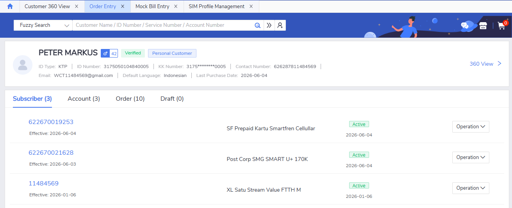

Transfer Ownership option selected, jumps to target customer page:

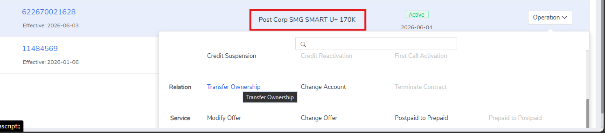

Target customer selected and new account created:

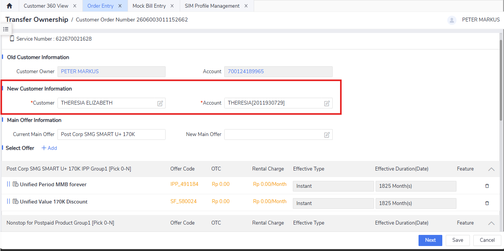

Order details reviewed (basic info, order fee, order item list) - old customer contact info displayed correctly:

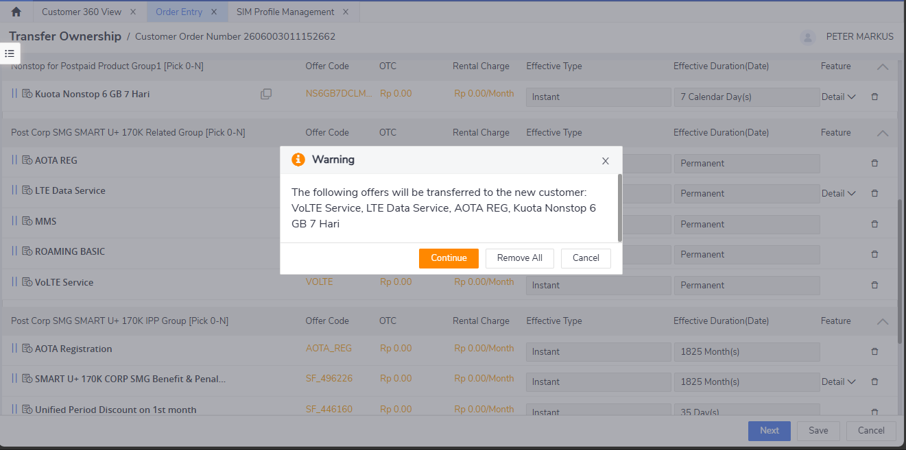
*Confirmation pop-up is shown to evaluate whether the transfer ownership should continue.*

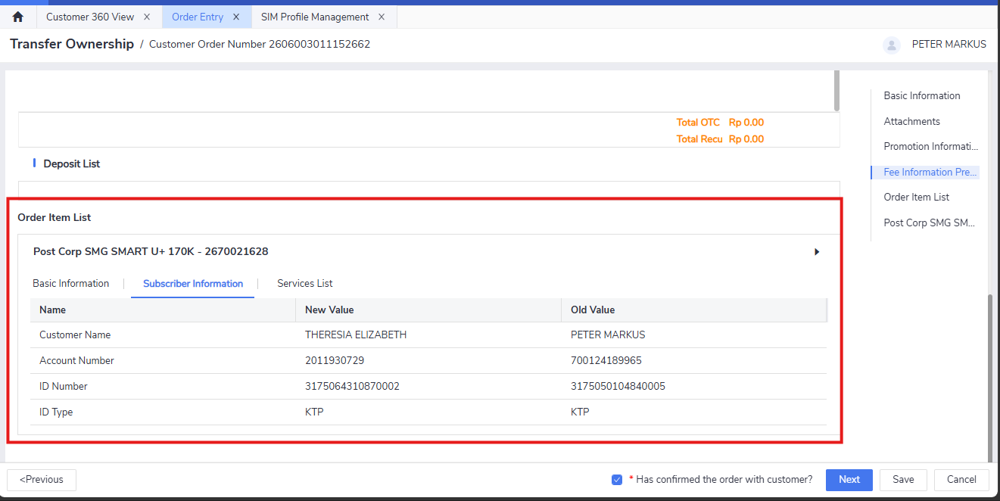
*The old customer and new customer is displayed in a table for review. The information displayed is correct.*

T&C reviewed and accepted successfully for both parties:

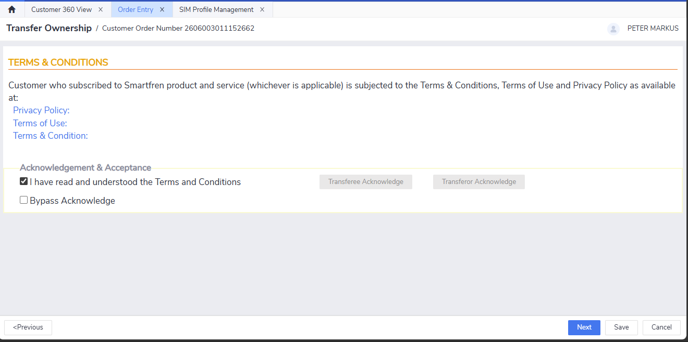

Payment counter displayed, order fee paid successfully (no fee).

POS Receipt, e-Receipt, and e-RF printed - e-RF shows new billing address:

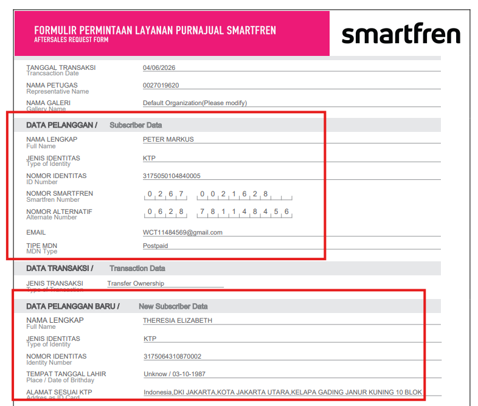

Order submitted successfully:

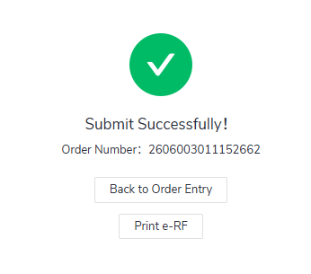

Order completed, order information verified correct:

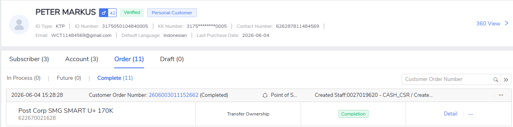

Subscriber Detail checked - subscriber transferred to target customer, status shows 'Transfer Out' under old customer:

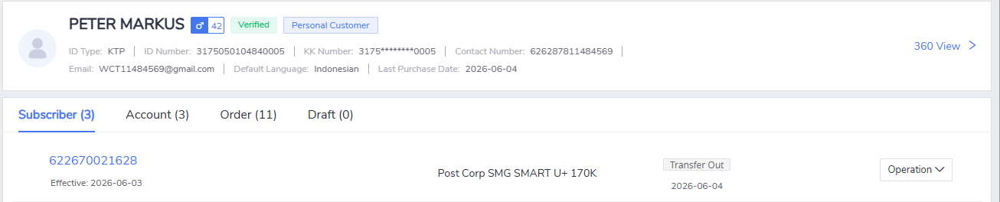
*Under old customer, showing 'Transfer Out'*

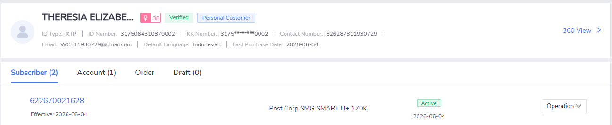
*Under new customer, showing 'Active'*

Benefits and deposits verified - subscriber-level and account-level benefits transferred to new account, deposits converted to advance payments:

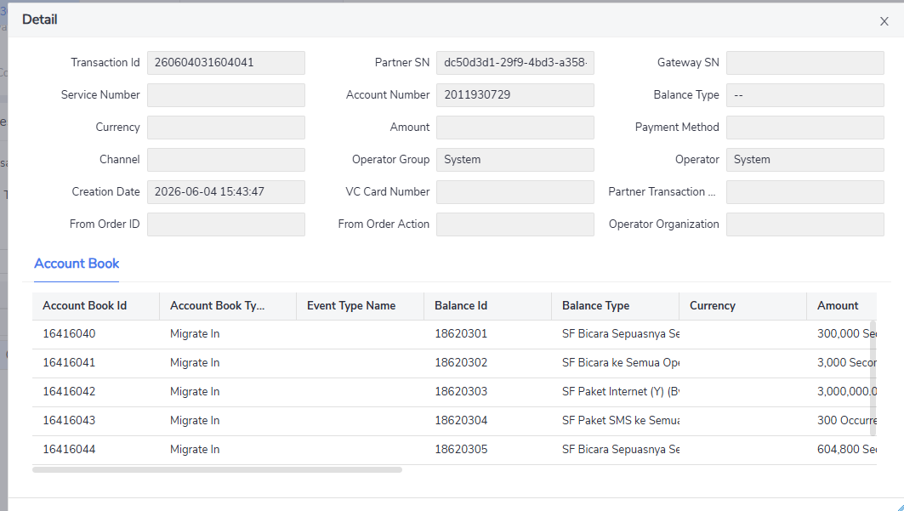

Notification sent to customer successfully:

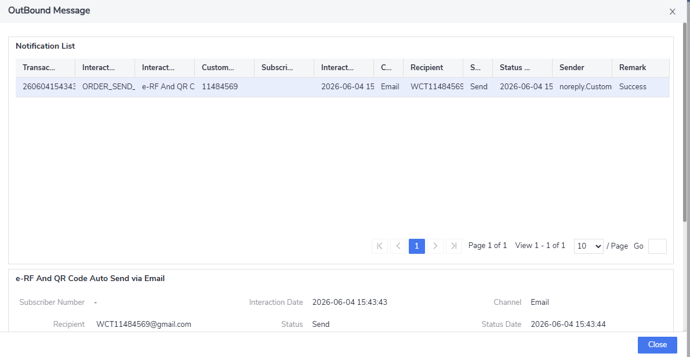

