# Test Ticket SF_E2E_OCP_159

**Description**: Reconnection subscriber with new main offer

**Pre-requisite**:

1. The system is running normally.
2. **Existing termination *postpaid* subscriber**.
3. The customer is not in internal blacklist.
4. The subscriber terminated less than 30 Days.
5. The customer is not in dunning blacklist.

**Test Status:** ***SUCCESS✅***

**Steps**:

| No. | Step | Data | Expected Results |
|-----|------|------|------------------|
| 1 | Go to 'Order Entry' GUI | Customer name: Neanderthal MSISDN: 622670022755 New main offer: Kuota 22 GB | Go to 'Order Entry' GUI successfully |
| 2 | Query termination postpaid subscription |  | Query termination postpaid subscription successfully |
| 3 | Click [Operation -> Reconnection] in 'Subscriber' tab |  | It jumps to next page successfully |
| 4 | Select new main offer and new account, then click 'Next' button |  | Select new main offer and account successfully |
| 5 | Click 'Use Old SIM Card' |  | Old ICCID will be displayed |
| 6 | Change LTE Data Service from VoLTE APN to LTE APN |  | Change successfully |
| 7 | Review basic information, order fee, order item list, and so on |  | The basic information, order fee, order item list, and others are correct |
| 8 | Select 'Has confirmed the order with customer?' and click 'Next' button |  | It jumps to next page successfully |
| 9 | Review and check the T&C |  | Review and check the T&C successfully |
| 10 | In payment counter, review order fee and pay it |  | Order fee payment is completed |
| 11 | Review and print 'Print POS Receipt', 'Print e-Receipt', and 'Print e-RF' |  | POS Receipt, e-Receipt, and e-RF are printed successfully and their information is correct |
| 12 | Click 'Next' button and submit the order |  | Order is generated successfully |
| 13 | Back to Order Entry page and check the order detail |  | The order is completed and order information is correct |
| 14 | Go to [Subscriber Detail] and check subscriber information |  | The subscriber status is 'Active' and SIM card status is 'In Use' |
| 15 | Check MSISDN/ICCID detail |  | The MSISDN and ICCID state is 'In Use' and MSISDN is bound with ICCID again |
| 16 | Check the notification |  | System sends notification to customer successfully |
| 17 | Check the provision information |  | The value of EXP_LTE_PROFILE has been changed |

**Evidence Results:**

!!! warning "Note"
    The main offer "Kuota 22 GB" is not available. But it's available as additional offer. So this test will assume "Kuota 22 GB" as additional offer, not main offer.

Query terminated postpaid subscriber is done smoothly:

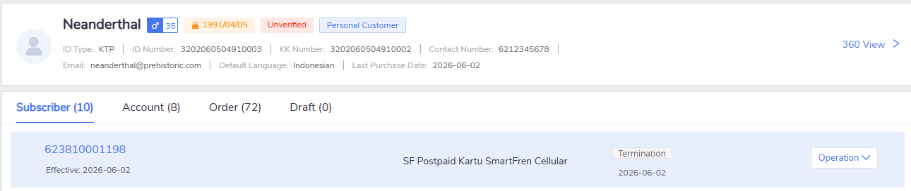

Click [Operation -> Reconnection] menu in 'Subscriber' tab is working, can be clicked and can proceed to the next step:

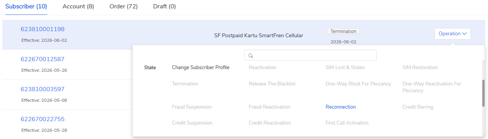

New "Kuota 22 GB" offer can be found and selected successfully:

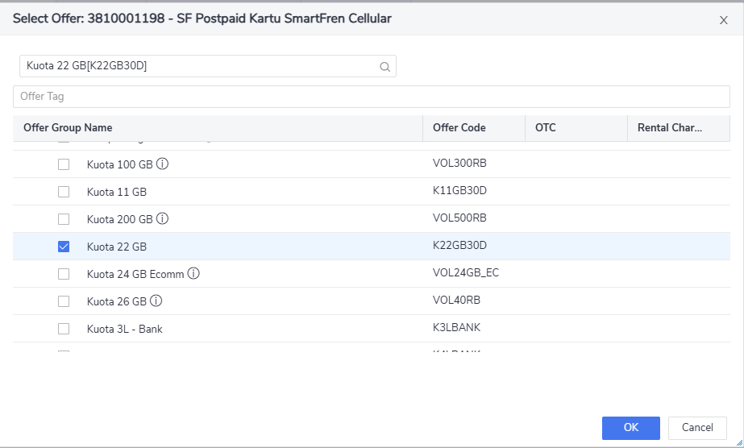

The "Use Old SIM card" option is available and can be selected properly:

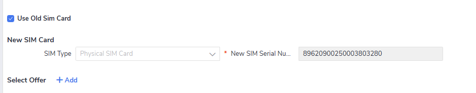

Changing VoLTE to LTE APN inside the LTE Data Service offer can be conducted successfully:

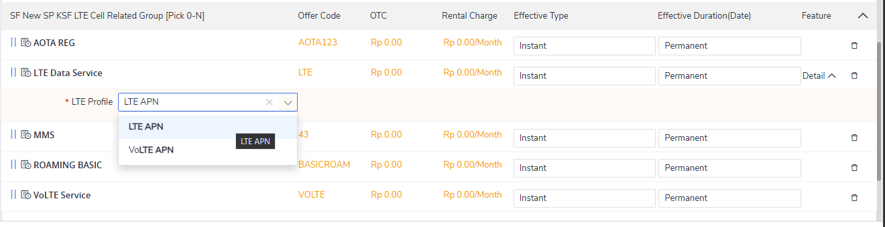

Order can display the correct old SIM card information and reflect the updated offer:

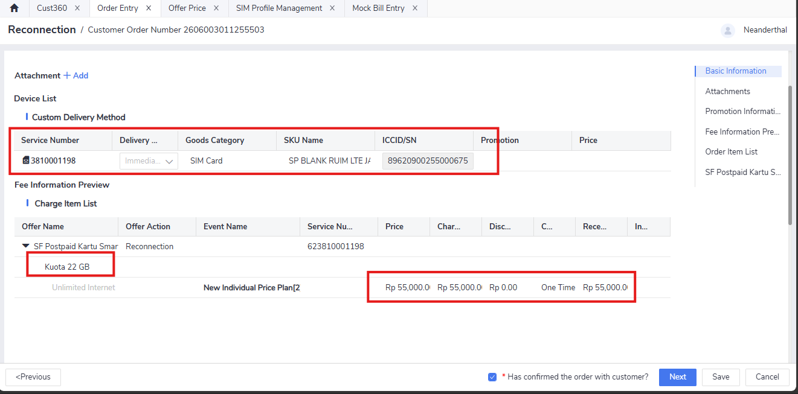

Bypassing acknowledgement is success:

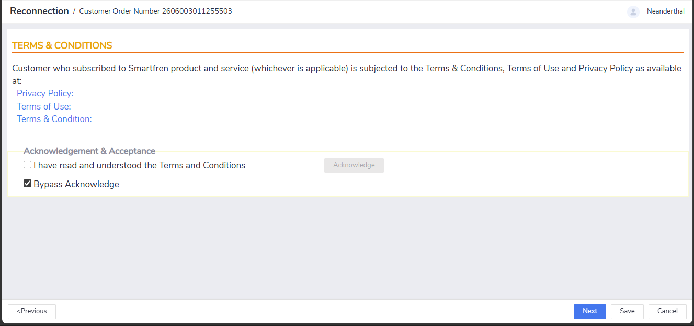

Order can be reviewed properly and the price reflects the new offer price correctly:

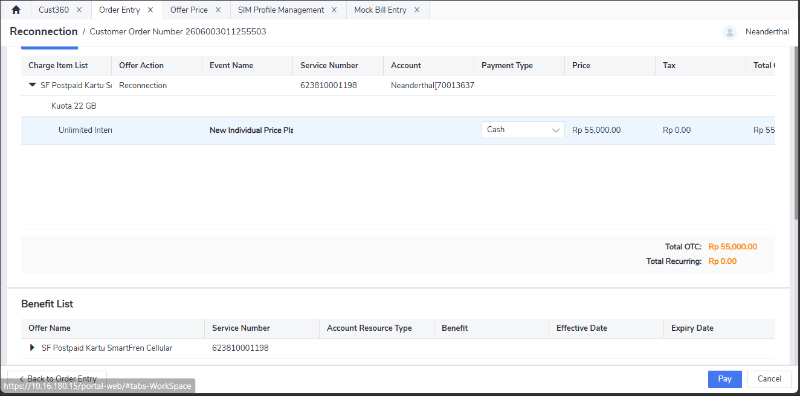

Receipt can be generated properly, the customer name is correct and amount paid is correctly written:

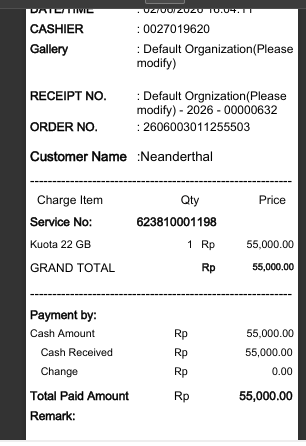

The subscriber is active, status reflected correctly and service number is still using the old one, which is as intended:

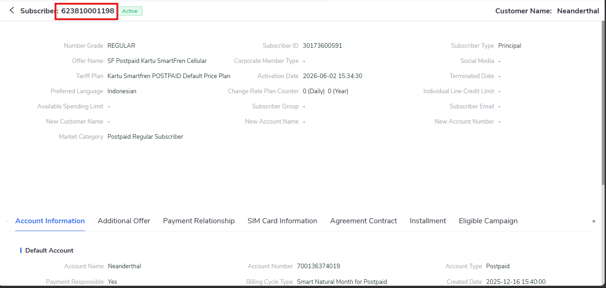

Upon checking the SIM card state, the state is reflected correctly as 'In Use' and the service number is shown correctly (in the picture a slight cropping occured due to insufficient view space):

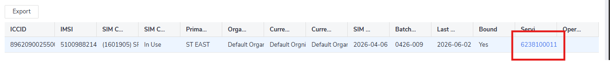

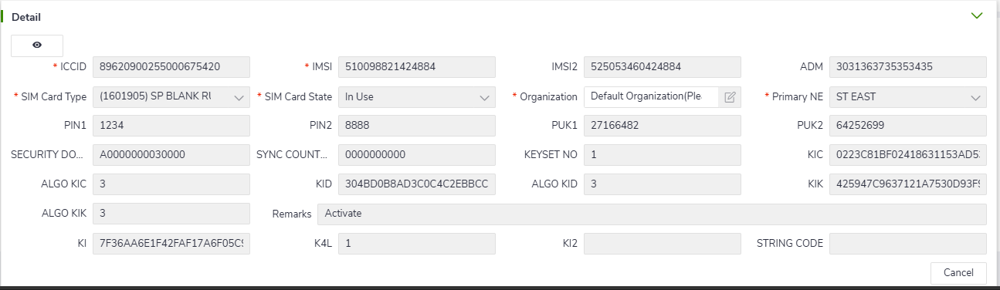

The provisioning state for `EXP_LTE_PROFILE` is also recorded the correct change:

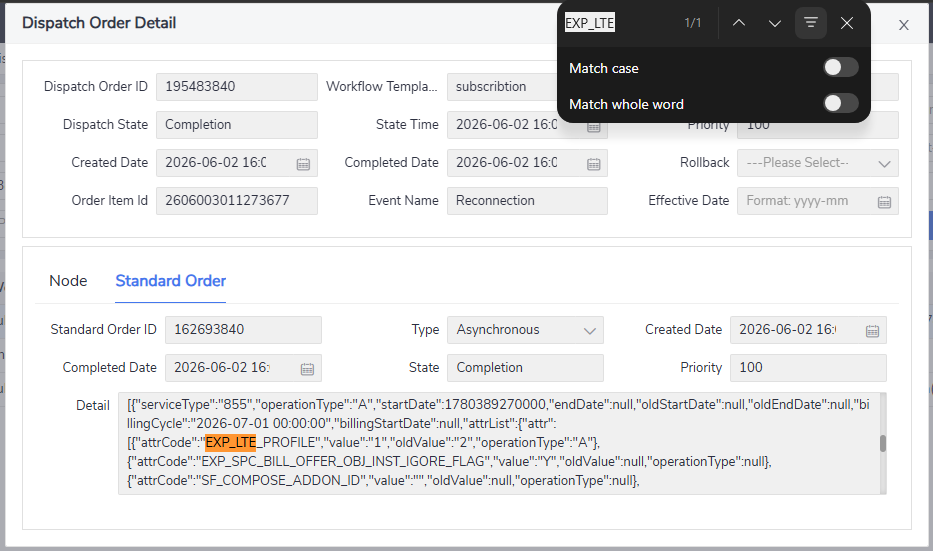

!!! tip "Tip"
    The provisioning state information can be found in two ways: one from **Order Entry** > **Order Detail**, the other from **Dispatch Order Query** menu.

