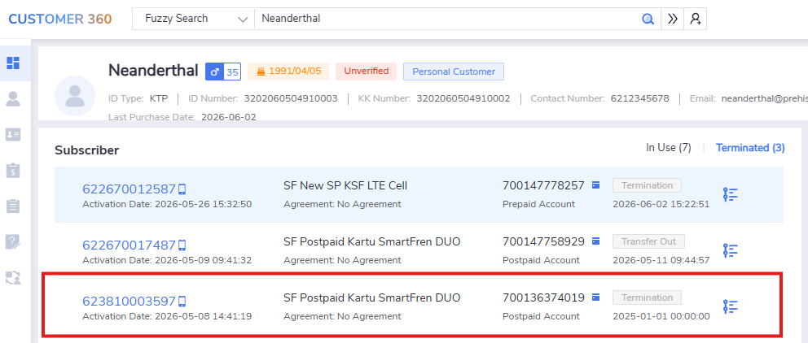
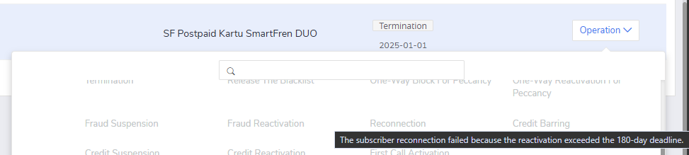

# Test Ticket SF_E2E_OCP_162

**Description**: Reconnection for termination MDN after X days (fail)

**Pre-requisite**:

1. The system is running normally.
2. Existing termination subscriber.
3. the termination MDN after X days

**Test Status:** ***SUCCESS✅***

**Steps**:

| No. | Step                                                     | Data | Expected Result                                                |
| --- | -------------------------------------------------------- | ---- | -------------------------------------------------------------- |
| 1   | Go to **‘Order Entry’ GUI**                              | -    | Got to **'Order Entry' GUI** successfully.                     |
| 2   | Query termination subscription                           | -    | Query termination subscription successfully.                   |
| 3   | Click **[Operation → Reconnection]** in 'Subscriber' Tab | -    | Prompt: More than X days. Not allowed to perform reconnection. |

**Evidence Results:**

The expired terminated subscribed can be simulated by doing manual update to the `cc.subs` database. Full query is shown below:

```sql
UPDATE prod
SET 
  prod_state_date = TO_DATE('2025-01-01', 'YYYY-MM-DD'),
  update_date = TO_DATE('2025-01-01', 'YYYY-MM-DD')
WHERE cust_id=3014104699
  AND subs_plan_id IS NOT NULL
  AND prod_state = 'B'
  AND prod_id=30127627143
;
COMMIT;
```

The terminated subscription can be queried successfully:



The reconnection option is greyed-out and not available. The prompt also showing hint that the current terminated subscriber already exceed 180 days:



