# Test Ticket SF_E2E_OCP_188

**Description**: When customer **already purchased** the starter pack, then user need to activate the starter pack. After starter pack is activated, customer can start use telco service（Existed Customer）.

**Pre-requisite**:

1. The system is running normally.
2. The status is initial for existed starter pack subscription.
3. The starter pack resources  is same with login user organization.
4. The resource status for the starter pack is ‘Sold’. and state is unblock

**Test Status:** ***SUCCESS✅***

**Steps**:

| No. | Step                                                                                                   | Data                                                                                                                                                                   | Expected Result                                                                                                                                 |
| --- | ------------------------------------------------------------------------------------------------------ | ---------------------------------------------------------------------------------------------------------------------------------------------------------------------- | ----------------------------------------------------------------------------------------------------------------------------------------------- |
| 1   | Go to **'Starter Pack' GUI**.                                                                          | **Customer Name:** AR-SP-E2E **State of MSISDN:** 1. Sold - Unblock = 628811701183 2. Stock In - Block = 628811701190 3. Stock In - Unblock = 628811701188 | Enter **'Starter Pack' GUI** successfully.                                                                                                      |
| 2   | Retrieve existing individual customer.                                                                 | -                                                                                                                                                                      | Query customer successfully.                                                                                                                    |
| 3   | Query a starter pack subscription by service number.                                                   | -                                                                                                                                                                      | Query starter pack subscription successfully and display the correct offer name, service number, SIM serial number, effective date, and status. |
| 4   | Select the starter pack subscription and click **'Active'**.                                           | -                                                                                                                                                                      | It jumps to the next page successfully.                                                                                                         |
| 5   | On the next page, supplement the required information (e.g., preferred language) and click **'Next'**. | -                                                                                                                                                                      | Supplementary information is added successfully.                                                                                                |
| 6   | Review activation order information, such as basic information and order item list.                    | -                                                                                                                                                                      | Order information is correct.                                                                                                                   |
| 7   | Review and check the Terms & Conditions (T&C).                                                         | -                                                                                                                                                                      | Review and check the T&C successfully.                                                                                                          |
| 8   | At the payment counter page, pay the order fee.                                                        | -                                                                                                                                                                      | Order fee is paid successfully.                                                                                                                 |
| 9   | Submit the order and check the order status.                                                           | -                                                                                                                                                                      | Order is generated successfully and reaches **Completion** status.                                                                              |
| 10  | Check and print **'Print e-RF'**.                                                                      | -                                                                                                                                                                      | Check and print **'Print e-RF'** successfully.                                                                                                  |
| 11  | Enter **[Subscriber Detail]** and check subscriber details.                                            | -                                                                                                                                                                      | The subscription status is **Active** and all other information is correct.                                                                     |

**Evidence Results:**

Initially, starter pack is in banned state. To lift the ban, need to go to the **Goods Sell** then purchase the starter pack in advance:

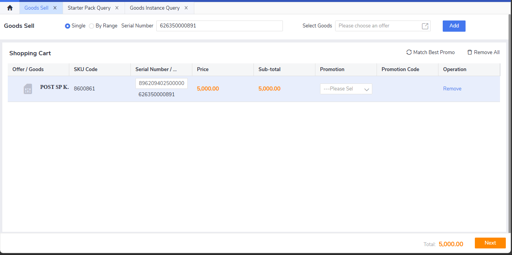

!!! tip "Tip"
    Can query the information of available starter pack inside **Goods Instance Query** menu.

For reference, the state of the starter pack before purchase is shown below:

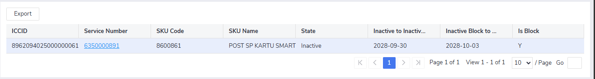

And after purchase is complete, the state is correctly showing N as not blocked anymore:

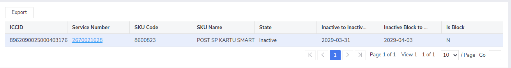

The state "Sold" is correctly shown in the Goods Instance query after buying the SP:

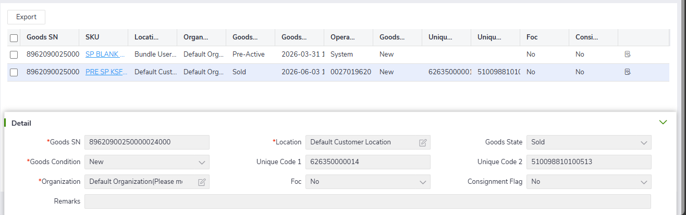

Starter pack can be queried successfully and the "Activate" button is able to be pressed:

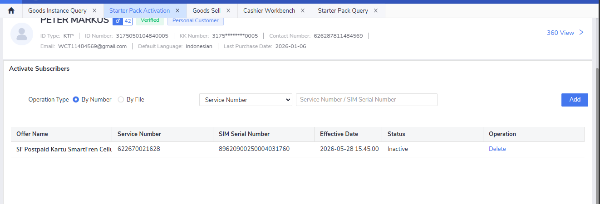

Order information can be seen correctly:

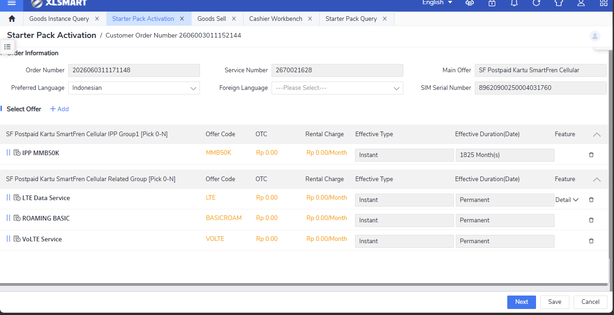

T&C is shown normally and can be bypassed in this testing:

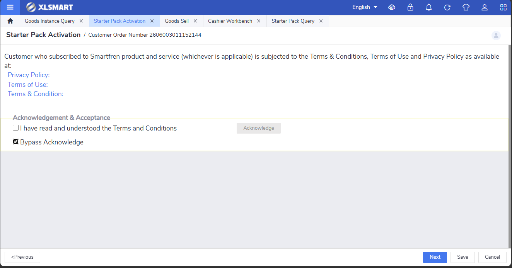

Order fee page is shown correctly, currently no fee since no additional IPP is selected:

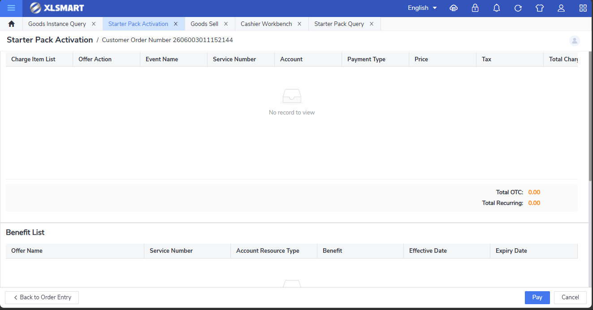

Order can be submitted successfully:

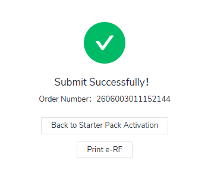

ERF is also shown correclt, stating "Starter Pack Activation" as the type of transaction:

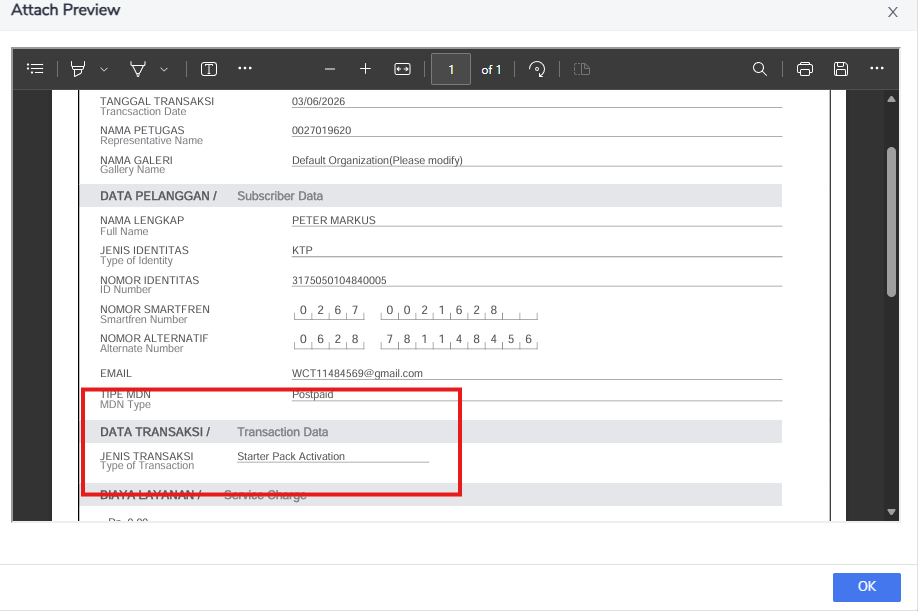

Starter pack activation order is displayed correctly in order page and the order status is "Completion", meaning the order has been successfully completed:

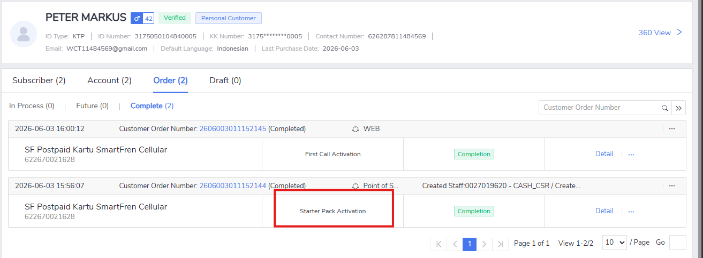

